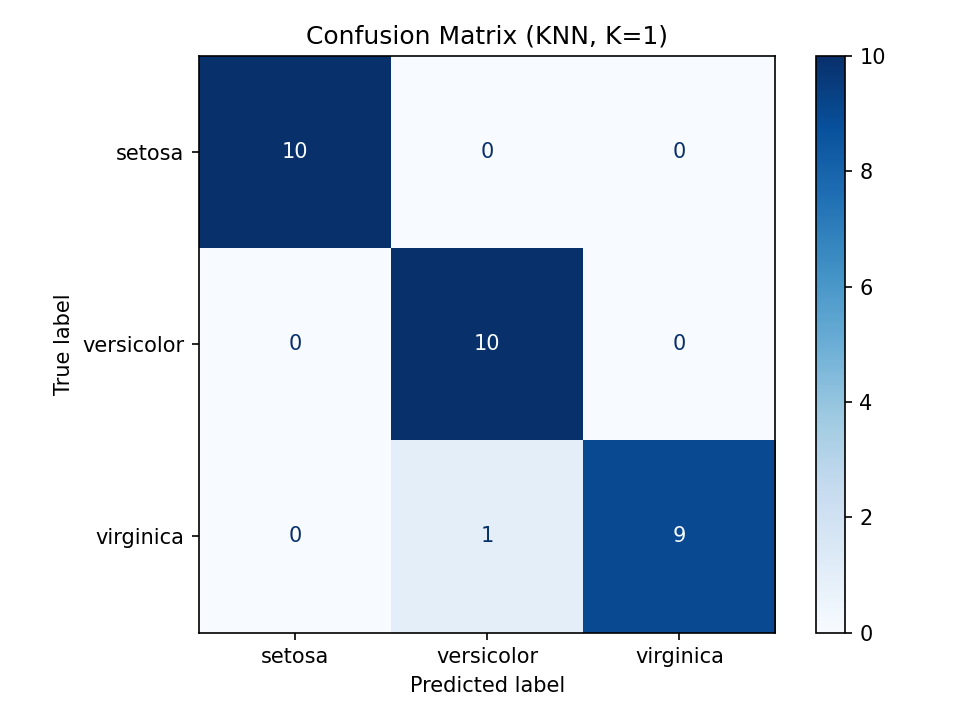
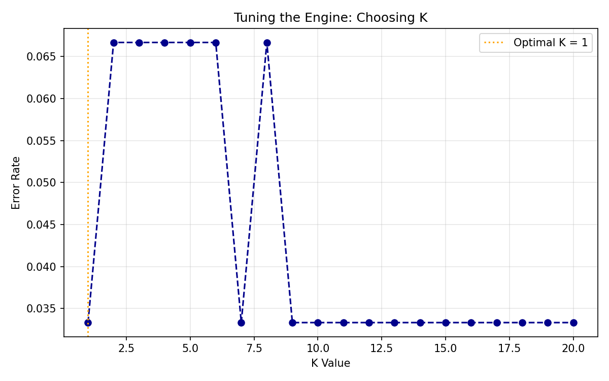

# 🌸 Iris Classification using K-Nearest Neighbors (KNN)

> **AI Engineering Internship — Project 2: Data Classification Using AI**.
> 
A complete, from-scratch supervised learning pipeline that trains, tests, and validates a K-Nearest Neighbors (KNN) classifier on the classic Iris dataset built to demonstrate the full machine learning workflow: data understanding, preprocessing, model training, hyperparameter tuning, and rigorous evaluation.

---

## 📌 Overview
This project moves beyond simple rule-based logic (`if/else` heuristics) into **Supervised Learning**: a machine that learns patterns directly from historical data rather than hardcoded rules.

Using the **Iris flower dataset**, the model learns to classify a flower into one of three species *Setosa*, *Versicolor*, or *Virginica* based on four measured features: sepal length, sepal width, petal length, and petal width.
```

---

## 🎯 Objective

Build a basic, reliable classification model that can:
- Load and understand a real-world dataset.
- Split data correctly into training and testing sets.
- Apply a simple, interpretable classification algorithm (KNN).
- Validate performance using proper evaluation metrics — not just raw accuracy.

---

## 🧠 Methodology — The IPO Framework
| Stage | What Happens |
|---|---|
| **Input** | Load the Iris dataset → inspect it → scale features with `StandardScaler`. |
| **Process** | Split into train/test sets → tune K → train the KNN model. |
| **Output** | Generate a Confusion Matrix → calculate F1 Score → validate results. |

### Why Feature Scaling?
KNN is a **distance-based** algorithm. Without scaling, features with larger numeric ranges (like petal length in cm) would dominate the distance calculation over smaller-range features. `StandardScaler` normalizes every feature to **mean = 0, variance = 1**, ensuring a fair comparison.

### Why Not Just Trust Accuracy?
On imbalanced data, a model can score 99% accuracy while still being useless (the "Accuracy Mirage"). This project reports the full **Confusion Matrix** and **F1 Score** (the harmonic mean of Precision and Recall) to give an honest picture of model performance per class.

### Choosing K
Rather than guessing a value for K, the script tests K = 1 through 20, tracks the error rate for each, and automatically selects the K value at the "elbow" the point of lowest error before the model starts underfitting.

---

## 📊 Dataset
**Source:** Built into `scikit-learn` (`sklearn.datasets.load_iris`) — no download required.
| Property | Value |
|---|---|
| Samples | 150 (perfectly balanced — 50 per class). |
| Features | 4 (sepal length, sepal width, petal length, petal width all in cm). |
| Classes | 3 (Setosa, Versicolor, Virginica). |
| Missing values | None |

---

## 🛠️ Tech Stack
- **Python 3.8+**
- [scikit-learn](https://scikit-learn.org/) — model, scaling, metrics, dataset
- [pandas](https://pandas.pydata.org/) — data handling.
- [numpy](https://numpy.org/) — numerical operations.
- [matplotlib](https://matplotlib.org/) & [seaborn](https://seaborn.pydata.org/) — visualization

---

## 🚀 Getting Started
### Prerequisites
- Python 3.8 or higher
- pip

### Installation
1. Clone the repository
   ```bash
   git clone https://github.com/<your-username>/iris-classification-knn.git
   cd iris-classification-knn
   ```

2. (Optional but recommended) Create a virtual environment
   ```bash
   python -m venv venv
   source venv/bin/activate      # On Windows: venv\Scripts\activate
   ```

3. Install dependencies
   ```bash
   pip install -r requirements.txt
   ```

### Usage
Run the full pipeline:
```bash
python project2_iris_classification.py
```

The script will print each pipeline stage to the console and save two plots (`k_tuning_curve.png` and `confusion_matrix.png`) to the project directory.

---

## 📈 Results
| Metric | Score |
|---|---|
| **Optimal K** | Auto-selected via elbow method |
| **Accuracy** | ~96–97% |
| **F1 Score (weighted)** | ~0.97 |

**Confusion Matrix:**


**K-Value Tuning Curve:**


> Exact numbers may vary slightly depending on the `random_state` seed and K search range.

---

## 🔍 Key Learnings
- End-to-end supervised learning workflow using `scikit-learn`.
- Correct data preprocessing order (fit scaler on train data only — avoiding data leakage).
- Hyperparameter tuning through empirical error-rate analysis.
- Model evaluation beyond raw accuracy using Confusion Matrix and F1 Score.

---

## 🔮 Future Improvements
- [ ] Compare KNN against other algorithms (Logistic Regression, Decision Tree, SVM).
- [ ] Add k-fold cross-validation instead of a single train-test split.
- [ ] Deploy as a simple web app (Streamlit/Flask) for interactive predictions.
- [ ] Extend pipeline to a custom, real-world dataset.

---

## 🏢 About
Built as part of the **DecodeLabs Industrial Training Kit — Batch 2026**.

📧 decodelabs.tech@gmail.com
🌐 [www.decodelabs.tech](https://www.decodelabs.tech)


## Author:
**Sumaira Safeer**
**Computer Engineer**

---

## 📄 License
This project is open source and available under the [MIT License](LICENSE).
